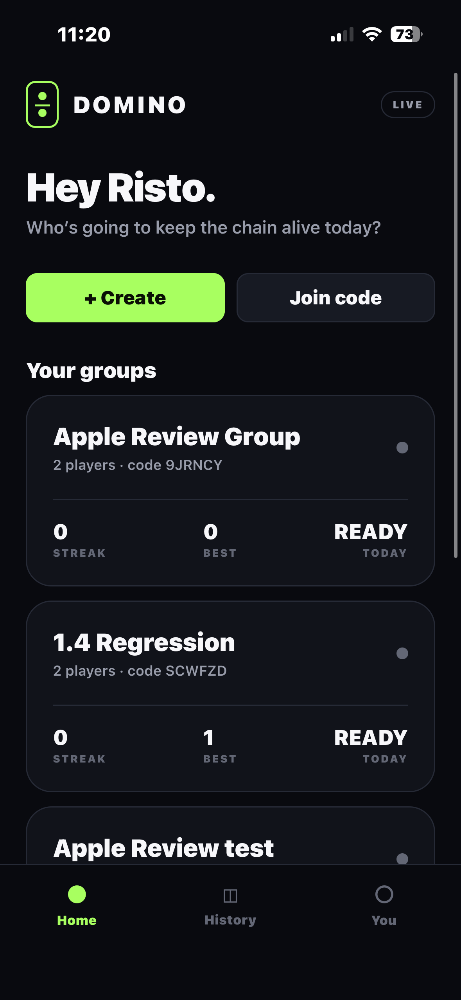
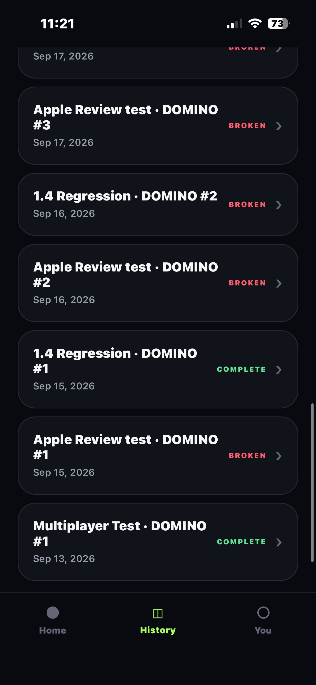

# Domino

Domino is a mobile social challenge app built around private groups completing a chain of daily real-world challenges.

One player starts the DOMINO. Completing a challenge unlocks the next player in the group. The goal is to complete the entire chain before someone runs out of time and breaks it.

> The production source code is maintained in a private repository.

## App Preview

<table>
  <tr>
    <td align="center"><strong>Home</strong></td>
    <td align="center"><strong>Completed Chain</strong></td>
    <td align="center"><strong>History</strong></td>
  </tr>
  <tr>
    <td></td>
    <td></td>
    <td></td>
  </tr>
</table>

<table>
  <tr>
    <td align="center"><strong>Broken Chain</strong></td>
    <td align="center"><strong>Authentication</strong></td>
  </tr>
  <tr>
    <td></td>
    <td></td>
  </tr>
</table>

## What Domino Does

Domino turns small groups into a shared daily challenge.

Each group works through a sequence of challenges one member at a time. Completing your turn keeps the chain alive and unlocks the next person. Missing the time limit breaks the chain.

Core features include:

- Private challenge groups
- Invite-code group joining
- Sequential member turns
- Timed challenges
- Photo, video and text proof
- Group streaks
- Completed and broken chains
- Challenge history
- Push notifications
- Group sharing
- Member management
- Authenticated accounts

## Tech Stack

- React Native
- Expo
- TypeScript
- Supabase
- PostgreSQL
- Supabase Authentication
- Supabase Storage
- Edge Functions
- Push notifications
- Git / GitHub

## Engineering Highlights

- Built the mobile application using React Native, Expo and TypeScript.
- Integrated Supabase authentication, PostgreSQL and cloud media storage.
- Implemented private group creation and invite-code joining.
- Built sequential challenge logic where one completed turn unlocks the next player.
- Added configurable time limits for challenge completion.
- Developed photo, video and text proof workflows.
- Implemented completed-chain and broken-chain states.
- Built persistent challenge history with group-based access controls.
- Added push-notification infrastructure using backend functions.
- Improved duplicate-write protection around important user actions.
- Handled shared multi-user state across navigation and application sessions.
- Built moderation-oriented functionality including proof reporting and player blocking.

## Challenge Flow

A Domino challenge follows a shared group sequence:

1. A group begins a DOMINO.
2. One member receives the first challenge.
3. The player completes the challenge within the allowed time.
4. Proof is submitted.
5. The next member is unlocked.
6. The chain continues until everyone completes their turn.
7. If someone runs out of time, the chain breaks.
8. Completed and broken DOMINOs remain available in history.

This requires shared application state to remain consistent across multiple users and devices.

## Backend & Shared State

Important game rules are backed by shared server-side data instead of relying only on the mobile client.

Backend responsibilities include:

- Group membership
- Challenge state
- Turn progression
- Historical access
- Notification workflows
- Media storage
- Membership-based permissions

Supabase provides authentication, PostgreSQL persistence, storage and server-side functionality.

## History & Access Control

Domino includes a history system for viewing completed and broken challenge chains.

Historical content is protected so access is tied to valid group membership rather than simply trusting the client.

This required backend-controlled access to shared historical data.

## Notifications

The application includes push-notification infrastructure for keeping group members aware of challenge activity.

Backend notification workflows are integrated with stored Expo push tokens and server-side processing.

## Reliability Work

Development has also focused on application reliability and edge cases.

Examples include:

- Preventing accidental duplicate group creation
- Persisting group settings correctly
- Handling joined-group state
- Restricting historical content by membership
- Managing shared state across screens
- Handling media-upload workflows
- Testing completed and broken challenge paths

## Development Process

Domino has been developed as a production-oriented iOS application.

Development has included:

1. Product design
2. Authentication
3. Group creation and joining
4. Shared challenge state
5. Timed challenge flows
6. Media proof
7. Push notifications
8. History and access controls
9. Duplicate-write protection
10. Mobile UX testing
11. Production and App Store preparation

## Source Code

The main application repository is private because it contains active application and backend configuration.

This repository provides a public technical and visual overview of the project.

## Developer

**Risto Caissie**  
Software Developer — Calgary, Alberta

📧 ristocaissie1@gmail.com
